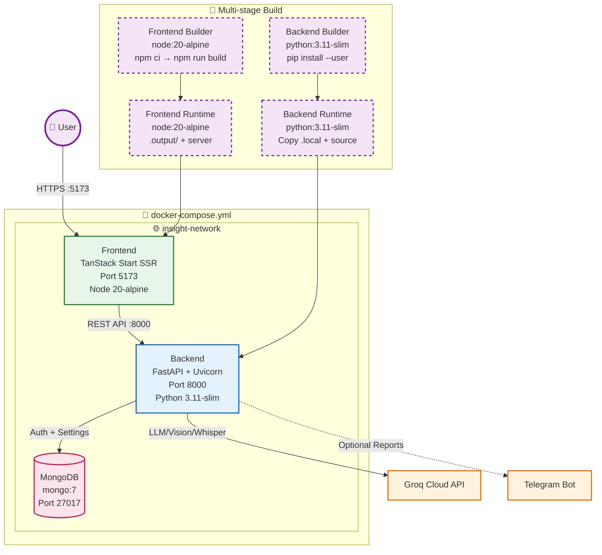

# Insight Engine - AI Data Analyst Platform

> **Full-stack AI platform for conversational data analysis, automated dashboards, and report generation.**  
> React (Frontend) • FastAPI + Groq LLM (Backend) • MongoDB Auth • File-based Storage

🔗 **Demo Drive Link:** [Google Drive Demo Folder](https://drive.google.com/drive/folders/1JDSeInUWhSbxwf4EhUVDvm-zY6g2ouhK?usp=drive_link)

---

## 🛠️ Tech Stack

| Layer | Technologies |
|---|---|
| **Frontend** | React, Recharts, Plotly |
| **Backend** | FastAPI, Python, Uvicorn |
| **AI / LLM** | Groq LLM |
| **Data Analysis** | Pandas, DuckDB |
| **Machine Learning** | Scikit-learn, Prophet |
| **Database** | MongoDB |
| **Authentication** | JWT (JSON Web Tokens) |
| **Report Generation** | PDF, DOCX |
| **Integration** | Telegram Bot • Google Drive • Gmail • Google Calendar |
| **Deployment** | Docker, Docker Compose |

---

## 🏗️ System Architecture

```text
                               👤 USER
                                  │
                 ┌────────────────┴────────────────┐
                 │                                 │
           Ask Question                    Upload CSV Dataset
                 │                                 │
                 └────────────────┬────────────────┘
                                  │
                                  ▼
                  React Frontend (TanStack Start)
                                  │
                                  ▼
                    JWT Authentication (MongoDB)
                                  │
                                  ▼
                        FastAPI Backend API
                                  │
             ┌────────────────────┼────────────────────┐
             │                    │                    │
             ▼                    ▼                    ▼
      Dataset Service      Chat Service       Report Service
             │                    │
             ▼                    ▼
      CSV Validation      Intent Classification
             │                    │
             ▼                    ▼
      Pandas CSV Parser     Tool Routing Engine
             │                    │
             ▼                    │
     Data Cleaning & Validation   │
             │                    │
             ▼                    │
 Quality Score & Metadata         │
             │                    │
             ▼                    ▼
      Dataset Registry      Load Dataset
             │                    │
             └────────────┬───────┘
                          │
                          ▼
                  Analysis Engine
                          │
      ┌───────────────────┼────────────────────┐
      ▼                   ▼                    ▼
 Pandas Analysis     DuckDB SQL        Dashboard Builder
      │                   │                    │
      ├──────────────┬────┴────────────┐
      ▼              ▼                 ▼
 Anomaly        Forecasting      Chart Generator
 Detection        (Prophet)        (Recharts,Plotly)
(Isolation Forest)
      │
      ▼
 Groq LLM (Explanation Only)
      │
      ▼
 Response Formatter
      │
 ┌────┼───────────────┬──────────────┐
 ▼    ▼               ▼              ▼
Text Charts      SQL Result      Insights
      │
      ▼
 Report Generator
      │
 ┌────┼──────────────┐
 ▼    ▼              ▼
PDF  DOCX   Telegram Bot Upload -> (Drive,Calender)
      │
      ▼
 Final API Response
      │
      ▼
 React Dashboard
```

---

## 🚀 Local Deployment

```bash
# 1. Backend
cd backend
python -m venv .venv
source .venv/bin/activate          # Windows: .venv\Scripts\activate
pip install -r requirements.txt
cp .env.example .env
# Edit .env → add GROQ_API_KEY, MONGODB_URL, JWT_SECRET_KEY
uvicorn app.main:app --reload --port 8000

# 2. Frontend
cd frontend
npm install
npm run dev
# Opens http://localhost:5173
```

---

## 🐳 Docker Deployment

```bash
# Build & run with docker-compose
docker-compose up -d --build

# Services:
# - Frontend: http://localhost:5173
# - Backend API: http://localhost:8000
# - API Docs: http://localhost:8000/docs
# - MongoDB: localhost:27017
```

**Required env vars for Docker:**
```bash
GROQ_API_KEY=your_groq_key
MONGODB_URL=mongodb://mongodb:27017
JWT_SECRET_KEY=your_32_char_min_secret
CORS_ORIGINS=http://localhost:5173,http://localhost:3000
```



### Quick Start with Docker

```bash
# 1. Create .env file with required variables
cat > .env << 'EOF'
GROQ_API_KEY=your_groq_api_key_here
MONGODB_URL=mongodb://mongodb:27017
JWT_SECRET_KEY=your-super-secret-key-min-32-chars-long
CORS_ORIGINS=http://localhost:5173,http://localhost:3000
TELEGRAM_BOT_TOKEN=8974667061:AAH49-3urvoK8OkodO9le-vHBZkMueI69vQ
TELEGRAM_CHAT_ID=6798365742
EOF

# 2. Build and start all services
docker-compose up -d --build

# 3. Access the application
# Frontend: http://localhost:5173
# Backend API: http://localhost:8000
# API Docs: http://localhost:8000/docs
```

### Docker Services Overview

| Service | Image | Ports | Depends On | Health Check |
|---------|-------|-------|------------|--------------|
| `mongodb` | `mongo:7` | 27017 | - | `db.runCommand("ping")` |
| `backend` | Built from `Dockerfile` | 8000 | mongodb | `GET /health` |
| `frontend` | Built from `Dockerfile.frontend` | 5173 | backend | `GET /` |

### Docker Files in Project

```
insight-engine/
├── Dockerfile              # Backend (FastAPI) - multi-stage
├── Dockerfile.frontend     # Frontend (TanStack Start) - multi-stage
├── docker-compose.yml      # Orchestration (Mongo + Backend + Frontend)
├── docker-entrypoint.sh    # Startup script (not used in compose)
└── .dockerignore           # Build context exclusions
```

### Environment Variables for Docker

```bash
# Required
GROQ_API_KEY=gsk_xxxxxxxxxxxx
MONGODB_URL=mongodb://mongodb:27017
JWT_SECRET_KEY=your-32-char-minimum-secret-key
CORS_ORIGINS=http://localhost:5173,http://localhost:3000

# Telegram Bot (for report delivery)
TELEGRAM_BOT_TOKEN=8974667061:AAH49-xxxxxxxxxxxxxxx-xxxxxxxxxxxxx
TELEGRAM_CHAT_ID=6798365742
```

---

## 🔑 Required Environment Variables

| Variable | Description | Required |
|----------|-------------|----------|
| `GROQ_API_KEY` | Groq API key for LLM/Vision/Whisper | ✅ Yes |
| `MONGODB_URL` | MongoDB connection string | ✅ Yes |
| `JWT_SECRET_KEY` | HS256 signing key (min 32 chars) | ✅ Yes |
| `CORS_ORIGINS` | Comma-separated frontend origins | ✅ Yes |
| `TELEGRAM_BOT_TOKEN` | Bot token from @BotFather | ✅ Yes |
| `TELEGRAM_CHAT_ID` | Chat/group/channel ID to send files to | ✅ Yes |

---

## 📚 Deep-Dive Documentation

| Document | Focus |
|----------|-------|
| [`PROCESS_OF_BACKEND.md`](./PROCESS_OF_BACKEND.md) | Config, models, storage, all 8 services, routers, Groq client, auth, sandbox, deployment |
| [`PROCESS_OF_FRONTEND.md`](./PROCESS_OF_FRONTEND.md) | Routing, TanStack Query, component system, page flows, API contract, patterns, deployment |
| [`PROJECT_SUMMARY.md`](./PROJECT_SUMMARY.md) | Full conversation history, tech stack, API overview, troubleshooting |

---
