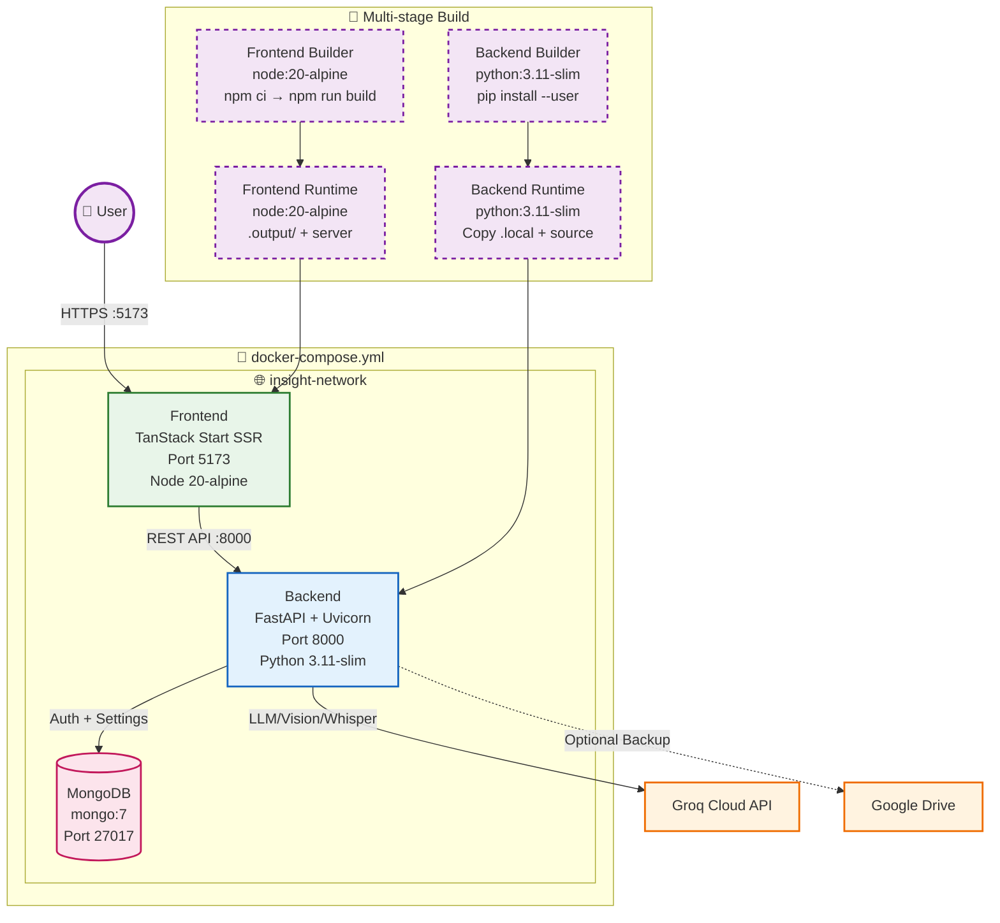

# Insight Engine - AI Data Analyst Platform

> **Full-stack AI platform for conversational data analysis, automated dashboards, and report generation.**  
> React (Frontend) • FastAPI + Groq LLM (Backend) • MongoDB Auth • File-based Storage

---

## 🏗️ System Architecture

```mermaid
flowchart TB
    %% ===== FRONTEND =====
    subgraph FE [🌐 Frontend (React 19 + TanStack Start)]
        direction TB
        UI[UI Components<br/>shadcn/ui + Radix + Tailwind v4]
        Router[TanStack Router<br/>File-based routes + SSR]
        Query[TanStack Query v5<br/>Server state + caching]
        AuthCtx[AuthContext<br/>JWT + User state]
        
        %% Pages
        Pages[Pages]
        ChatPage[/chat - AI Chat/]
        DashPage[/dashboard - BI Dashboard/]
        DataPage[/datasets - Data Management/]
        ReportPage[/reports - Report Generation/]
        SettingsPage[/settings - Config/]
        AuthPage[/ - Auth Gate/]
        
        UI --> Router
        Router --> Query
        Router --> AuthCtx
        Router --> Pages
        Pages --> ChatPage & DashPage & DataPage & ReportPage & SettingsPage & AuthPage
    end

    %% ===== BACKEND =====
    subgraph BE [🔧 Backend (FastAPI + Python 3.11+)]
        direction TB
        Main[main.py<br/>FastAPI + CORS + Routers]
        Config[config.py<br/>Pydantic Settings]
        Models[models.py<br/>Pydantic ↔ TypeScript]
        
        %% Routers
        Routers[API Routers]
        AuthR[/auth - JWT Signup/Signin/Me/]
        DataR[/datasets - Upload/List/Preview/Delete/]
        ChatR[/chat - AI Agent + Voice/]
        AnlR[/analysis - Chart/Anomaly/Forecast/SQL/]
        DashR[/dashboard - KPIs + Charts/]
        RepR[/reports - PDF/DOCX Generation/]
        HistR[/history - Unified Timeline/]
        
        %% Services
        Services[Business Logic Services]
        AuthS[auth_service.py<br/>JWT + bcrypt + MongoDB]
        DataS[dataset_service.py<br/>Ingest + Clean + Quality + Join Keys]
        AnlS[analysis.py<br/>Charts + Anomalies + Forecast + SQL/Pandas]
        ChatS[chat_service.py<br/>Intent Classification → Tool Routing]
        RepS[report_service.py<br/>PDF + DOCX + 2 Charts]
        ForeS[forecast_service.py<br/>Prophet + Linear Fallback]
        AnomS[anomaly_service.py<br/>Z-Score + IQR]
        
        %% Clients
        GroqC[groq_client.py<br/>3-Model Fallback Chain]
        DB[(MongoDB<br/>Users + Settings)]
        Store[storage.py<br/>JSON + CSV Persistence]
        Files[(File System<br/>CSV + Reports)]
    end

    %% ===== EXTERNAL =====
    subgraph EXT [☁️ External Services]
        Groq[Groq API<br/>llama-3.3-70b + whisper]
        Drive[Google Drive API<br/>(optional report backup)]
    end

    %% ===== CONNECTIONS =====
    FE -- "HTTPS / REST + SSE" --> BE
    BE -- "API Calls" --> Groq
    BE -- "Optional Upload" --> Drive
    AuthS -.-> DB
    Store -.-> Files
    DataS -.-> Files
    RepS -.-> Files
    
    %% ===== STYLING =====
    classDef fe fill:#e8f5e9,stroke:#2e7d32,stroke-width:2px;
    classDef be fill:#e3f2fd,stroke:#1565c0,stroke-width:2px;
    classDef ext fill:#fff3e0,stroke:#ef6c00,stroke-width:2px;
    classDef db fill:#fce4ec,stroke:#c2185b,stroke-width:2px,stroke-dasharray: 5 5;
    
    class FE fe;
    class BE be;
    class EXT ext;
    class DB,Files db;
```

---

## 🔄 Core Workflow: From CSV + Prompt to Insights

```mermaid
flowchart TD
    %% ===== USER INPUT =====
    User((👤 User)) -->|1. Upload CSV/Excel/Image| Upload[POST /upload]
    User -->|2. Type Question/Prompt| Chat[POST /chat]
    
    %% ===== INGESTION PIPELINE =====
    Upload --> Validate{Valid Format?}
    Validate -- CSV/Excel --> ReadCSV[pd.read_csv / pd.read_excel]
    Validate -- Image --> Vision[Groq Vision API → Extract Table as CSV]
    Validate -- Invalid --> Err400[❌ 400 Unsupported Format]
    
    ReadCSV --> Clean[_clean_df: strip cols, coerce numbers, drop empty]
    Vision --> Clean
    Clean --> Score[_quality_score: completeness×0.8 + uniqueness×0.2]
    Clean --> JKeys[_detect_join_keys: _id, code, key, unique+non-null]
    Score & JKeys --> Persist[Save CSV → data/datasets/ds_<id>.csv]
    Persist --> Meta[Save Metadata → meta.json]
    Meta --> DSResp[Dataset Response: {id, name, rows, cols, quality, join_keys}]
    
    %% ===== CHAT / AGENT PIPELINE =====
    Chat --> LoadDS[Load DataFrame(s) from storage.py]
    LoadDS --> MultiDS{Multiple Datasets?}
    MultiDS -- Yes --> Join[combined_df(): Auto-join on shared keys<br/>or concat fallback]
    MultiDS -- No --> SingleDF[Use Single DataFrame]
    Join & SingleDF --> Intent[classify_intent(message, has_data)]
    
    %% ===== INTENT ROUTING =====
    Intent -->|chart| ChartFlow[📊 Chart Generation]
    Intent -->|anomaly| AnomalyFlow[🔍 Anomaly Detection]
    Intent -->|forecast| ForecastFlow[📈 Forecasting]
    Intent -->|sql| SQLFlow[🗄️ SQL Generation + Execution]
    Intent -->|pandas| PandasFlow[🐼 Pandas Code Gen + Sandbox Exec]
    Intent -->|report| ReportFlow[📄 Report Generation]
    Intent -->|analyze/chat| AnalyzeFlow[💬 Analyze / Conversational]
    
    %% ===== SERVICE LAYER =====
    subgraph Services [🔧 Backend Services]
        direction TB
        
        %% Dataset Service
        DSvc[dataset_service.py]
        DSvc -.->|Ingest| Clean
        DSvc -.->|Quality| Score
        DSvc -.->|Join Keys| JKeys
        DSvc -.->|Preview| Preview[Paginated Data Preview]
        
        %% Analysis Service
        ASvc[analysis.py]
        ChartFlow --> ASvc
        AnomalyFlow --> ASvc
        ForecastFlow --> ASvc
        SQLFlow --> ASvc
        PandasFlow --> ASvc
        
        ASvc -->|build_chart_spec| ChartSpec[ChartSpec JSON<br/>type, x_key, y_keys, data, meta]
        ASvc -->|detect_anomalies| AnomOut[Flagged Rows + Summary<br/>Z-score>3 + IQR 1.5×]
        ASvc -->|forecast| ForeOut[ChartSpec + Confidence Intervals<br/>Prophet or Linear Trend]
        ASvc -->|generate_sql/execute_sql| SQLOut[SQL String + Result DataFrame<br/>DuckDB in-memory]
        ASvc -->|generate_pandas/run_pandas| PandasOut[Python Code + Result<br/>Sandboxed: 30s timeout, no imports/IO]
        ASvc -->|build_dashboard| DashOut[KPIs + 4 Charts + Filters]
        
        %% Chat Service
        CSvc[chat_service.py]
        CSvc -.->|Orchestrates| ASvc
        CSvc -.->|Loads Data| Store[storage.py]
        CSvc -.->|History| Conv[Conversation Memory<br/>Last 20 turns]
        CSvc -.->|Narrator| GroqN[Groq LLM: Structured Prompt]
        
        %% Groq Client
        GC[groq_client.py]
        GC -.->|3-Model Fallback| Models[llama-3.3-70b → kimi-k2 → qwen3-32b]
        GC -.->|Vision| Vision
        GC -.->|Whisper| Whisper[Voice → Text]
        
        %% Report Service
        RSvc[report_service.py]
        ReportFlow --> RSvc
        RSvc -->|LLM Insights| Insights[ExecSummary + 5 KeyMetrics + Insights + Anomalies + Recs]
        RSvc -->|2 Charts| RCharts[Bar + Line with Heuristic Bullets]
        RSvc -->|Matplotlib| Render[Render Charts as PNG]
        RSvc -->|ReportLab| PDF[PDF Report]
        RSvc -->|python-docx| DOCX[DOCX Report]
        RSvc -.->|Optional| Drive[Google Drive Upload]
        
        %% Auth Service
        AuthS[auth_service.py]
        AuthS -.->|JWT HS256| Token[7-day Access Token]
        AuthS -.->|bcrypt| Hash[Password Hashing]
        AuthS -.->|MongoDB| Users[Users Collection]
    end
    
    %% ===== OUTPUTS =====
    ChartSpec --> ChatResp[ChatResponse: {message, chart, execution_trace}]
    AnomOut --> ChatResp
    ForeOut --> ChatResp
    SQLOut --> ChatResp
    PandasOut --> ChatResp
    AnalyzeFlow --> ChatResp
    DashOut --> DashResp[DashboardResponse: {kpis, charts, filters}]
    PDF & DOCX --> RepResp[Report Metadata: {id, urls, drive_url}]
    
    ChatResp --> FE[Frontend Render]
    DashResp --> FE
    RepResp --> FE
    
    %% ===== STYLING =====
    classDef user fill:#f3e5f5,stroke:#7b1fa2,stroke-width:3px;
    classDef input fill:#e8f5e9,stroke:#2e7d32,stroke-width:2px;
    classDef process fill:#e3f2fd,stroke:#1565c0,stroke-width:2px;
    classDef service fill:#fff3e0,stroke:#ef6c00,stroke-width:2px;
    classDef output fill:#fce4ec,stroke:#c2185b,stroke-width:2px;
    classDef storage fill:#f1f8e9,stroke:#558b2f,stroke-width:2px,stroke-dasharray: 5 5;
    
    class User user;
    class Upload,Chat,Validate,ReadCSV,Vision,Clean,Score,JKeys,Persist,Meta,LoadDS,MultiDS,Join,SingleDF,Intent input;
    class ChartFlow,AnomalyFlow,ForecastFlow,SQLFlow,PandasFlow,ReportFlow,AnalyzeFlow process;
    class DSvc,ASvc,CSvc,GC,RSvc,AuthS,Store,Conv,Models,Token,Hash,Users,Vision,Whisper,Preview service;
    class ChatResp,DashResp,RepResp,FE output;
    class DSResp,Store storage;
```

---

## 📦 Data Flow Summary

```mermaid
flowchart LR
    subgraph Ingestion
        U1[Upload CSV/Excel/Image] --> P1[Parse + Clean]
        P1 --> P2[Quality Score + Join Keys]
        P2 --> S1[Save CSV + Meta]
    end
    
    subgraph Analysis
        U2[Chat / Dashboard / Report] --> P3[Load DataFrame(s)]
        P3 --> P4[Auto-Join if Multiple]
        P4 --> P5[Analysis Service]
        P5 --> C1[Chart Spec]
        P5 --> C2[Anomalies]
        P5 --> C3[Forecast]
        P5 --> C4[SQL/Pandas Result]
        P5 --> C5[Dashboard KPIs+Charts]
    end
    
    subgraph Reporting
        U3[Generate Report] --> P6[LLM Insights + 2 Charts]
        P6 --> R1[PDF via ReportLab]
        P6 --> R2[DOCX via python-docx]
        R1 & R2 --> S2[Save to data/reports/]
        S2 --> S3[Optional: Google Drive]
    end
    
    subgraph Persistence
        S1 -.-> FS[(File System<br/>data/datasets/*.csv<br/>data/reports/*.pdf|docx)]
        S2 -.-> FS
        DB[(MongoDB<br/>Users + Settings)] <-.-> Auth[Auth Service]
        Store[storage.py<br/>meta.json + history.json] -.-> FS
    end
```

---

## 🗂️ Project Structure at a Glance

```
insight-engine/
├── README.md                    ← You are here
├── PROJECT_SUMMARY.md           ← Full change log + architecture notes
├── PROCESS_OF_BACKEND.md        ← Backend deep-dive (19 sections)
├── PROCESS_OF_FRONTEND.md       ← Frontend deep-dive (13 sections)
│
├── backend/                     ← FastAPI Application
│   ├── app/
│   │   ├── main.py              ← App entry, CORS, router registration
│   │   ├── config.py            ← Pydantic Settings (.env)
│   │   ├── models.py            ← Pydantic schemas (≡ frontend types.ts)
│   │   ├── storage.py           ← JSON + CSV persistence (Store class)
│   │   ├── database.py          ← MongoDB connection + indexes
│   │   ├── groq_client.py       ← Groq SDK wrapper + 3-model fallback
│   │   ├── routers/             ← 9 route files (auth, datasets, chat, analysis, ...)
│   │   └── services/            ← 8 service modules (auth, dataset, analysis, chat, report, forecast, anomaly, drive)
│   ├── data/                    ← Persisted files (gitignored)
│   │   ├── datasets/            ← ds_<id>.csv
│   │   ├── reports/             ← report_<id>.pdf | .docx
│   │   ├── meta.json            ← Dataset metadata + history + settings
│   │   └── history.json         ← Chat/analysis timeline
│   ├── requirements.txt
│   └── .env.example
│
└── frontend/                    ← React + TanStack Start (SSR)
    ├── src/
    │   ├── routes/              ← 10 file-based routes (/, /chat, /dashboard, ...)
    │   ├── components/
    │   │   ├── ui/              ← shadcn/ui primitives (Button, Card, Dialog, ...)
    │   │   ├── app/             ← Layout: AppSidebar, TopNavbar, PageHeader, KpiCard, ChartCard
    │   │   ├── chat/            ← ChatMessage, ChatInput, ExecutionTimeline
    │   │   ├── charts/          ← ChartCard (Recharts + Plotly hybrid)
    │   │   └── auth/            ← AuthModal (full-page Sign In/Up), AuthPage
    │   ├── context/AuthContext.tsx  ← JWT + user state + login/signup/logout
    │   ├── lib/api/             ← Typed API layer (client, endpoints, types)
    │   ├── hooks/               ← use-theme, use-mobile
    │   └── styles.css           ← Tailwind v4 + CSS variables
    ├── package.json
    ├── vite.config.ts
    └── .env.example
```

---

## 🚀 Quick Start

```bash
# 1. Backend
cd backend
python -m venv .venv
source .venv/bin/activate          # Windows: .venv\Scripts\activate
pip install -r requirements.txt
cp .env.example .env
# Edit .env → add GROQ_API_KEY, MONGODB_URL, JWT_SECRET_KEY
uvicorn app.main:app --reload --port 8000

# 2. Frontend
cd frontend
npm install
npm run dev
# Opens http://localhost:5173
```

---

## 🐳 Docker Deployment

```bash
# Build & run with docker-compose
docker-compose up -d --build

# Services:
# - Frontend: http://localhost:5173
# - Backend API: http://localhost:8000
# - API Docs: http://localhost:8000/docs
# - MongoDB: localhost:27017
```

**Required env vars for Docker:**
```bash
GROQ_API_KEY=your_groq_key
MONGODB_URL=mongodb://mongodb:27017
JWT_SECRET_KEY=your_32_char_min_secret
CORS_ORIGINS=http://localhost:5173,http://localhost:3000
```

---

## 🐳 Docker Deployment



### Quick Start with Docker

```bash
# 1. Create .env file with required variables
cat > .env << 'EOF'
GROQ_API_KEY=your_groq_api_key_here
MONGODB_URL=mongodb://mongodb:27017
JWT_SECRET_KEY=your-super-secret-key-min-32-chars-long
CORS_ORIGINS=http://localhost:5173,http://localhost:3000
GOOGLE_DRIVE_ENABLED=false
EOF

# 2. Build and start all services
docker-compose up -d --build

# 3. Access the application
# Frontend: http://localhost:5173
# Backend API: http://localhost:8000
# API Docs: http://localhost:8000/docs
```

### Docker Services Overview

| Service | Image | Ports | Depends On | Health Check |
|---------|-------|-------|------------|--------------|
| `mongodb` | `mongo:7` | 27017 | - | `db.runCommand("ping")` |
| `backend` | Built from `Dockerfile` | 8000 | mongodb | `GET /health` |
| `frontend` | Built from `Dockerfile.frontend` | 5173 | backend | `GET /` |

### Docker Files in Project

```
insight-engine/
├── Dockerfile              # Backend (FastAPI) - multi-stage
├── Dockerfile.frontend     # Frontend (TanStack Start) - multi-stage
├── docker-compose.yml      # Orchestration (Mongo + Backend + Frontend)
├── docker-entrypoint.sh    # Startup script (not used in compose)
└── .dockerignore           # Build context exclusions
```

### Environment Variables for Docker

```bash
# Required
GROQ_API_KEY=gsk_xxxxxxxxxxxx
MONGODB_URL=mongodb://mongodb:27017
JWT_SECRET_KEY=your-32-char-minimum-secret-key
CORS_ORIGINS=http://localhost:5173,http://localhost:3000

# Optional
GOOGLE_DRIVE_ENABLED=false
GOOGLE_DRIVE_CREDENTIALS_PATH=/app/credentials.json
GOOGLE_DRIVE_FOLDER_ID=your_folder_id
```

### Production Tips

1. **Use secrets** - Store `GROQ_API_KEY` and `JWT_SECRET_KEY` in Docker secrets or `.env` (not in image)
2. **Reverse proxy** - Put nginx/Traefik in front for SSL termination
3. **Volumes** - `backend_data` and `mongodb_data` persist across restarts
4. **Scaling** - Backend can run multiple workers: `--workers 4` in uvicorn CMD
5. **Health checks** - All services have health checks for orchestration

---

## 🔑 Required Environment Variables

| Variable | Description | Required |
|----------|-------------|----------|
| `GROQ_API_KEY` | Groq API key for LLM/Vision/Whisper | ✅ Yes |
| `MONGODB_URL` | MongoDB connection string | ✅ Yes |
| `JWT_SECRET_KEY` | HS256 signing key (min 32 chars) | ✅ Yes |
| `CORS_ORIGINS` | Comma-separated frontend origins | ✅ Yes |
| `GOOGLE_DRIVE_ENABLED` | `true`/`false` — enable Drive backup | ❌ Optional |
| `GOOGLE_DRIVE_CREDENTIALS_PATH` | Service account JSON path | ❌ Optional |
| `GOOGLE_DRIVE_FOLDER_ID` | Target folder ID for uploads | ❌ Optional |

---

## 📚 Deep-Dive Documentation

| Document | Focus |
|----------|-------|
| [`PROCESS_OF_BACKEND.md`](./PROCESS_OF_BACKEND.md) | Config, models, storage, all 8 services, routers, Groq client, auth, sandbox, deployment |
| [`PROCESS_OF_FRONTEND.md`](./PROCESS_OF_FRONTEND.md) | Routing, TanStack Query, component system, page flows, API contract, patterns, deployment |
| [`PROJECT_SUMMARY.md`](./PROJECT_SUMMARY.md) | Full conversation history, tech stack, API overview, troubleshooting |

---

## 🧭 Navigation Guide

| If you want to... | Start here |
|-------------------|------------|
| Understand the overall system | This README (diagrams above) |
| Modify authentication | `PROCESS_OF_BACKEND.md` §11 + `PROCESS_OF_FRONTEND.md` §2/§11 |
| Add a new chart type | `PROCESS_OF_BACKEND.md` §6 + `PROCESS_OF_FRONTEND.md` §4 |
| Extend the chat agent | `PROCESS_OF_BACKEND.md` §7 (chat_service.py) |
| Customize report output | `PROCESS_OF_BACKEND.md` §10 (report_service.py) |
| Add a new API endpoint | `PROCESS_OF_BACKEND.md` §9 + `PROCESS_OF_FRONTEND.md` §6/§10 |
| Debug a production issue | `PROJECT_SUMMARY.md` → Troubleshooting table |

---

## 🏷️ Version & License

**Version:** 1.0.0 (Active Development)  
**License:** MIT — See [LICENSE](./LICENSE) if present

---

*Generated from project documentation. Diagrams render natively on GitHub/GitLab/Bitbucket.*# AI-DATA-ANALYSIS-DBO
